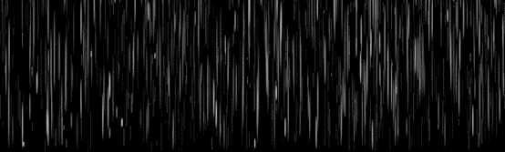
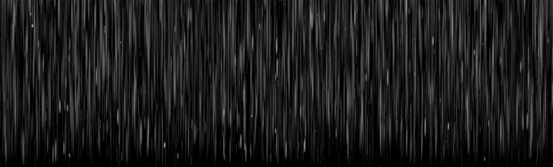
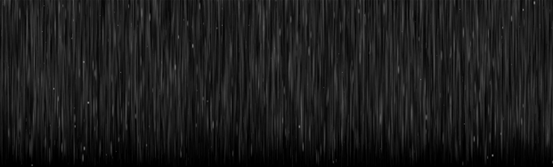
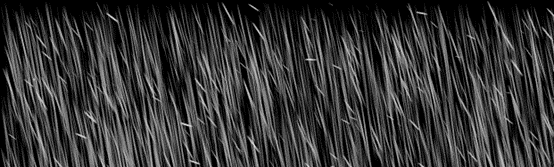
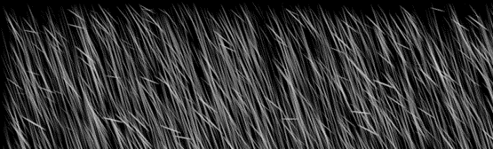
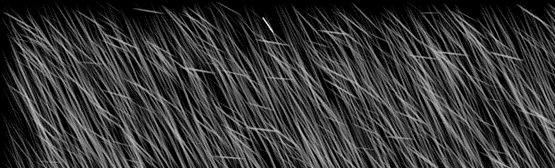
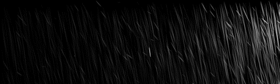
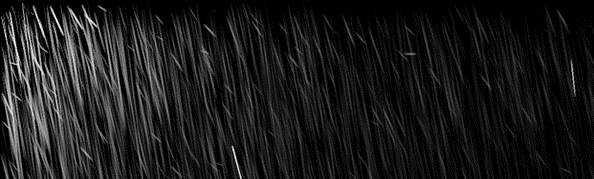
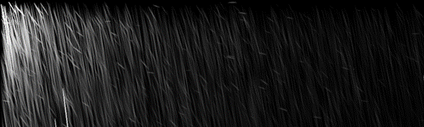

# PhysicRain 🌧️
**A Physics-Based Rain Prior Generator for Vision Foundation Models**
**面向视觉大模型的物理雨景先验生成器**

**PhysicRain** is a lightweight, pure physics-based 3D rain simulation and rendering engine. It is designed to generate high-fidelity, structurally controlled spatial drop distribution maps. These maps serve as precise **physics-based priors (Spatial Conditioning)** for downstream Diffusion Models (e.g., DiT, Stable Diffusion) to guide complex weather editing and scene generation, solving the issue of physical inconsistency in pure data-driven AIGC models.

**PhysicRain** 是一个轻量级、基于纯物理定律的 3D 雨景仿真与渲染引擎。本项目旨在生成高保真、物理结构受控的雨滴空间分布图。该特征图可作为精确的**空间物理先验（Physics-based Prior）**，引导下游的扩散模型（如 DiT, Stable Diffusion）进行复杂的天气编辑与场景生成，解决纯数据驱动的 AIGC 模型在物理结构上容易崩坏的痛点。

---

## ✨ Features / 核心特性

* **🔬 Microphysics Modeling / 严谨的微物理建模**
  * Accurately simulates Drop Size Distribution (DSD) using the **Gamma distribution**. Incorporates aerodynamic terminal velocity and 3D wind vectors to trace realistic physical trajectories.
  * 采用 **Gamma 分布**精准模拟真实气象学中的雨滴尺寸分布。内建空气动力学终端速度模型与 3D 风速矢量计算，真实还原粒子运动学轨迹。
* **🎥 Advanced Optical Rendering / 高级光学前向渲染**
  * Integrates the **Henyey-Greenstein phase function** for sub-surface scattering. Simulates Depth of Field (DoF) via Circle of Confusion (CoC) and integrates bokeh along the motion path to create highly realistic motion blur.
  * 集成 **Henyey-Greenstein 相位函数**精确计算次表面散射。通过计算弥散圆 (CoC) 模拟景深，并利用光斑 (Bokeh) 沿轨迹积分实现逼真的动态模糊。
* **🤖 AIGC-Ready Guidance / 完美契合大模型架构**
  * Outputs high-contrast spatial masks tailored for zero-invasive conditioning mechanisms like **Intrinsic Map-Aware Attention (IMAA)** or ControlNet, forcing foundation models to render realistic light-water interactions.
  * 输出的高保真特征图可直接转化为**本征图感知注意力机制（IMAA）**或 ControlNet 的空间掩码，引导视觉大模型精准“脑补”出水滴折射与局部积水反光等复杂交互。

---

## 📸 Gallery / 渲染效果展示

本项目支持对气象与光学参数进行高度可控的调节。以下展示了在强降雨（`RAIN_RATE = 50`）基准下，控制单一物理变量所带来的渲染变化：

### 1. 粒子密度控制 (Particle Budget)
调整 `PARTICLE_BUDGET` 参数，精确控制视锥体内的雨滴数量，模拟不同量级的降雨视觉密度：

| 稀疏 (Sparse) <br> `N = 1000` | 中等 (Medium) <br> `N = 5000` | 密集 (Dense) <br> `N = 20000` |
| :---: | :---: | :---: |
|  |  |  |

### 2. 风速运动学控制 (Wind Vector)
调整 `WIND_VECTOR` 的水平分量，结合曝光时间，生成符合流体力学位移的斜向雨丝与动态模糊：

| 微风 (Light Wind) <br> `Wind X = 1.0` | 阵风 (Moderate Wind) <br> `Wind X = 2.0` | 大风 (Strong Wind) <br> `Wind X = 3.0` |
| :---: | :---: | :---: |
|  |  |  |

### 3. 光照与散射控制 (Light Direction)
调整光源方向 `LIGHT_DIRECTION`，配合 Henyey-Greenstein 相位函数，改变雨滴表面的高光反射与次表面散射表现：

| 右侧顶光 (Light 1) <br> `[0.5, -0.3, 0.8]` | 左侧顶光 (Light 2) <br> `[-0.5, -0.5, 0.8]` | 左侧顶光 (Light 3) <br> `[-0.5, -0.5, 0.8]` |
| :---: | :---: | :---: |
|  |  |  |

---

## 🚀 Quick Start / 快速开始

### Dependencies / 依赖安装
This project is built on a lightweight Python scientific stack. No heavy deep learning frameworks are required for the rendering engine.
本项目基于轻量级的 Python 科学计算栈，渲染引擎部分无重型深度学习框架依赖：
```bash
pip install numpy scikit-image scipy pillow tqdm
Run the Engine / 运行引擎
Execute the main script to start the 3D particle importance sampling and the forward rendering pipeline.
直接运行主程序，引擎将自动执行 3D 粒子重要性采样及前向渲染管线：

Bash
python main.py
(After execution, a high-res rain prior map like rain_sim_R5.0_final_droplet.png will be generated in the root directory. / 执行完成后，根目录下将生成一张高清的物理雨滴引导图。)

⚙️ Configuration / 核心参数配置
You can easily control the physics environment by tweaking the parameters in the Config class within main.py:
你可以通过修改 main.py 中 Config 类的参数，轻松控制物理世界的环境变量：

RAIN_RATE: Rainfall intensity / 降雨强度 (mm/h)

WIND_VECTOR: 3D wind speed / 3D 风速向量 (m/s)

EXPOSURE_TIME: Camera exposure time affecting motion blur length / 模拟相机的曝光时间，影响雨丝长度

FOCUS_DISTANCE & F_NUMBER: Depth of Field controls / 景深控制参数

🗺️ Roadmap / 后续计划
[x] Step 1: Build a physics-based 3D rain simulation and optical rendering engine (Current Repo). / 完成基于物理的 3D 雨滴仿真与光学渲染引擎。

[ ] Step 2: Extract multi-scale physical features (e.g., via DINOv2) and inject them into a Diffusion Transformer (DiT) using Attention Bias (IMAA) for high-fidelity rainy scene transfer. / 提取多尺度物理特征，通过注意力偏置注入机制引导 DiT 完成真实雨天场景的高保真迁移。
